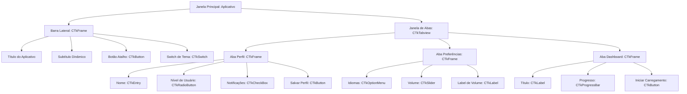

# Tkinter & CustomTkinter Study Lab

[](https://www.python.org/)
[](https://customtkinter.tomaszgasior.pl/)
[](https://github.com/astral-sh/uv)
[](https://www.microsoft.com/windows)

## Table of Contents

- [Context](#-context)
- [Software features](#-software-features)
- [Technologies and tools](#-technologies-and-tools)
- [Architecture](#-architecture)
- [Repository structure](#-repository-structure)
- [Requirements](#-requirements)
- [How to run](#-how-to-run)
- [Autor](#-autor)

# 📌 Context 

Este é um repositório de estudos dedicado ao desenvolvimento de Interfaces Gráficas de Usuário (GUIs) para Desktop em Python. O projeto demonstra passos práticos de aprendizado, partindo das caixas de diálogo nativas e básicas da biblioteca padrão **Tkinter** até a construção de uma aplicação desktop robusta, moderna e modular com suporte nativo a temas (como o Modo Escuro/Claro) utilizando o **CustomTkinter**.

O repositório documenta a evolução dos estudos em três fases de implementação distintas:
1. **Caixas de Diálogo Nativa (`main.py`)**: Interações de sistema com caixas de alerta (`messagebox`), entrada de texto (`simpledialog`) e seleção de caminhos de arquivos locais (`filedialog`).
2. **Interface Simples (`sistema.py`)**: Layout estrutural básico de uma tela de cadastro usando os widgets clássicos do Tkinter com posicionamento via gerenciador `pack`.
3. **Aplicação Completa (`sistema-completo.py`)**: Uma interface rica desenvolvida sob conceitos de Orientação a Objetos (OOP) com CustomTkinter, dotada de barra lateral, abas, simulações de carregamento e manipulação de preferências em tempo real.

## 🚀 Software features

- **Alternador de Tema (Modo Escuro / Claro)**: Um switch deslizante (`CTkSwitch`) na barra lateral que altera dinamicamente todo o esquema visual do sistema.
- **Simulador de Dashboard**: Uma barra de progresso interativa (`CTkProgressBar`) que simula o carregamento ou processamento de informações em tempo real.
- **Formulário de Perfil Completo**: Campos de entrada de texto (`CTkEntry`), seleção de níveis de permissão com botões de rádio (`CTkRadioButton`) e opções de preferências via caixa de seleção (`CTkCheckBox`).
- **Atualização Dinâmica de Estado**: Ao salvar as configurações do perfil, o cabeçalho e subtítulo da barra lateral são atualizados instantaneamente com o nome e nível de acesso configurados.
- **Painel de Preferências**: Opções de seleção de idiomas (`CTkOptionMenu`) e controle deslizante de volume (`CTkSlider`) que atualiza a porcentagem exibida na interface em tempo real.
- **Gerenciador de Abas Modular**: Transição fluida entre abas organizadas (`Perfil`, `Preferências`, `Dashboard`) usando o componente `CTkTabview`.

## 🛠️ Technologies and tools

- **Language**: Python (versão >= 3.12)
- **Framework**: CustomTkinter, Tkinter (GUI Nativa do Python)
- **Database**: N/A (Persistência em memória/simulado em console)
- **Tools**: UV (Gerenciador e instalador de pacotes ultrarrápido para Python), VS Code

## 📋 Architecture

A aplicação principal (`sistema-completo.py`) foi desenhada com uma arquitetura modular orientada a objetos (OOP) herdando de `customtkinter.CTk`. Abaixo está a representação estrutural da hierarquia de componentes da interface:



### Fluxo de Comportamento dos Componentes:
- **Gerenciamento de Aparência**: O switch `mudar_modo_dark` altera a propriedade de aparência global chamando `ctk.set_appearance_mode(...)`.
- **Sincronização de Dados**: O botão "Salvar Perfil" lê os valores dos inputs do formulário na aba Perfil e atualiza o estado dos widgets de texto presentes na barra lateral.
- **Manipulação de Eventos em Tempo Real**: O slider de volume utiliza um callback para atualizar o valor percentual em tempo real na tela.
- **Processamento de Progresso**: O botão "Iniciar Carregamento" executa um loop de atualização da barra de progresso que força a atualização do frame gráfico através de `self.update()`.

## 📁 Repository structure

```
lab-tkinter/
├── .vscode/                 # Configurações do ambiente de desenvolvimento no VS Code
├── main.py                  # Script inicial de exploração das caixas de diálogo nativas do Tkinter
├── pyproject.toml           # Configuração do projeto e suas dependências (CustomTkinter)
├── README.md                # Documentação e guia do projeto (este arquivo)
├── sistema.py               # Interface básica de estudo construída em Tkinter nativo
├── sistema-completo.py      # Aplicação desktop completa em CustomTkinter orientada a objetos
└── uv.lock                  # Arquivo de bloqueio de versões de pacotes gerado pelo UV
```

## 📦 Requirements

- **Python**: Versão 3.12 ou superior instalada.
- **UV**: Gerenciador de pacotes e ambientes Python instalado (recomendado para gerenciar o ambiente虚拟).
- **Editor de Código**: Visual Studio Code ou qualquer outro editor compatível.

## ⚙️ How to run

### 1. Clonar o Repositório
Faça o clone do repositório para o seu ambiente local e acesse o diretório:
```bash
git clone https://github.com/MatheusRodri/lab-tkinter.git
cd lab-tkinter
```

### 2. Instalar as Dependências
Com o **UV** instalado, execute o comando a seguir na pasta do projeto para criar o ambiente virtual `.venv` e instalar automaticamente o CustomTkinter:
```bash
uv sync
```

### 3. Executar as Etapas de Estudo

Você pode rodar cada um dos scripts sequenciais usando os comandos correspondentes abaixo:

*   **Executar Diálogos Nativo (`main.py`)**:
    ```bash
    uv run main.py
    ```

*   **Executar Interface Inicial (`sistema.py`)**:
    ```bash
    uv run sistema.py
    ```

*   **Executar Sistema Completo (`sistema-completo.py`)**:
    ```bash
    uv run sistema-completo.py
    ```

## 👤 Autor

Matheus Rodrigues 
[LinkedIn](https://linkedin.com/in/matheus-rodrigues-mrj) [GitHub](https://github.com/MatheusRodri)
